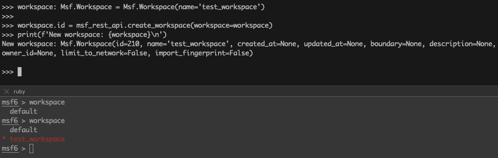
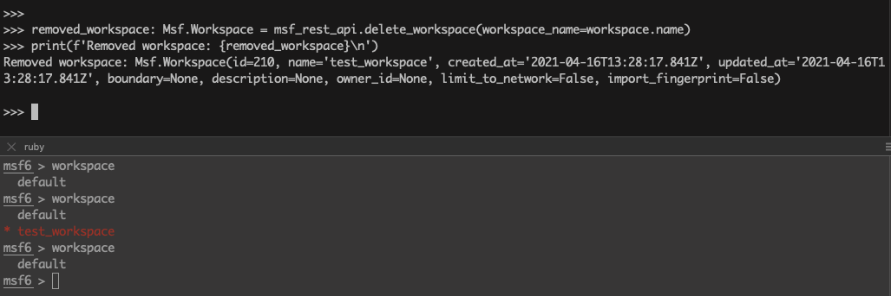
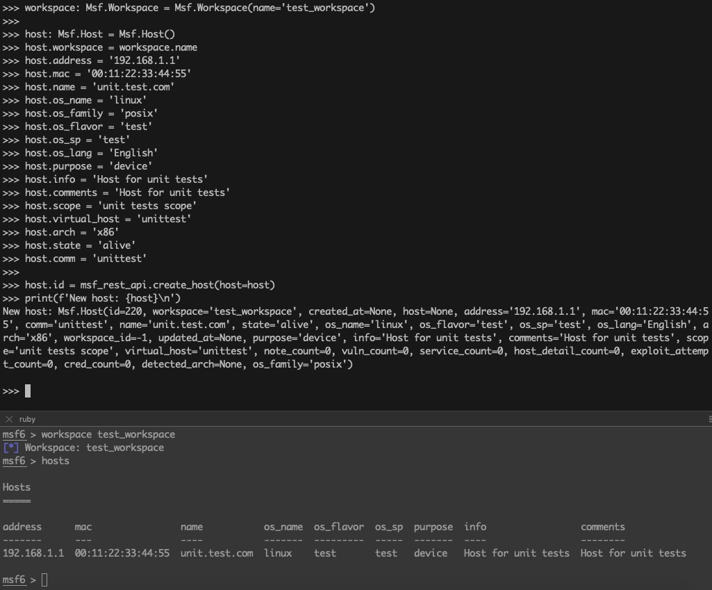
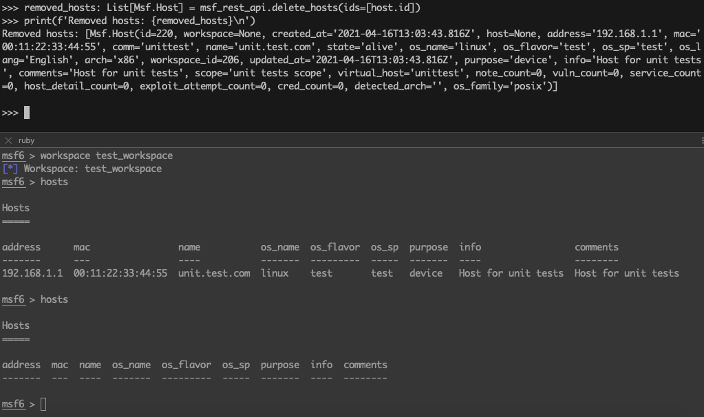
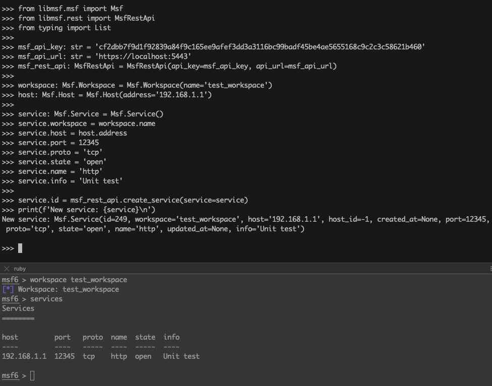
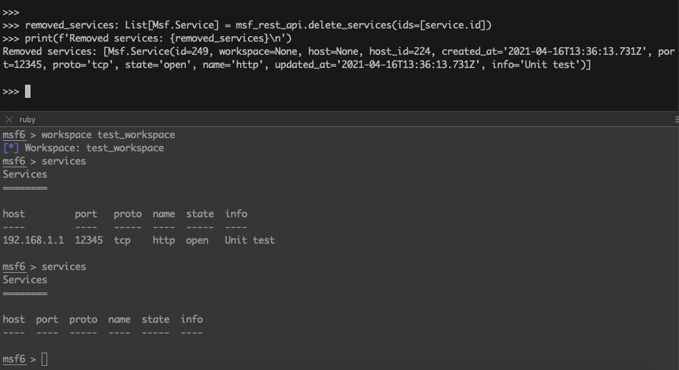

# python-libmsf

## Description

libmsf is a python library for working with Metasploit web service.

With libmsf you can work with Metasploit objects such as:

 - [Workspaces](#workspaces)
 - [Hosts](#hosts)
 - [Services](#services)
 - [Vulnerabilities](#vulnerabilities)
 - [Loots](#loots)
 - [Notes](#notes)
 - [Credentials](#credentials-and-logins)
 - [Logins](#credentials-and-logins)

libmsf easy to use:

```shell
>>> from libmsf.msf import Msf
>>> from libmsf.rest import MsfRestApi
>>> msf_rest_api = MsfRestApi(api_key='cf2dbb7f9d1f92839a84f9c165ee9afef3dd3a3116bc99badf45be4ae5655168c9c2c3c58621b460', api_url='https://localhost:5443')
>>> workspace: Msf.Workspace = Msf.Workspace(name='test_workspace')
>>> workspace
Msf.Workspace(id=-1, name='test_workspace', created_at=None, updated_at=None, boundary=None, description=None, owner_id=None, limit_to_network=False, import_fingerprint=False)
>>> workspace.id = msf_rest_api.create_workspace(workspace)
>>> msf_rest_api.get_workspace_by_id(workspace.id)
Msf.Workspace(id=197, name='test_workspace', created_at='2021-04-16T11:26:49.900Z', updated_at='2021-04-16T11:26:49.900Z', boundary=None, description=None, owner_id=None, limit_to_network=False, import_fingerprint=False)
```

## Python versions

 - Python 3.6
 - Python 3.7
 - Python 3.8
 - Python 3.9
 - Python 3.10

## Dependencies

 - [requests](https://pypi.org/project/requests/)
 - [urllib3](https://pypi.org/project/urllib3/)

## Installing

libmsf can be installed with [pip](https://pip.pypa.io/en/stable/):
```shell
pip3 install python-libmsf
```

Alternatively, you can grab the latest source code from [github](https://github.com/python-libmsf/python-libmsf.git):
```shell
git clone https://github.com/python-libmsf/python-libmsf.git
cd python-libmsf
python3 setup.py install
```

## Metasploit web service settings

Metasploit web service wiki: [https://github.com/rapid7/metasploit-framework/wiki/Metasploit-Web-Service](https://github.com/rapid7/metasploit-framework/wiki/Metasploit-Web-Service)

Init Metasploit web service and database: `msfdb init`

Init Metasploit web service: `msfdb --component webservice init`

Start Metasploit web service to listen all network interfaces: `msfdb --component webservice --address 0.0.0.0 start`

<details>
  <summary markdown="span">Init MSF webservice:</summary>

```shell
$ msfdb --component webservice init
Running the 'init' command for the webservice:
[?] Initial MSF web service account username? [user]: user
[?] Initial MSF web service account password? (Leave blank for random password):
Generating SSL key and certificate for MSF web service
Attempting to start MSF web service...success
MSF web service started and online
Creating MSF web service user user

    ############################################################
    ##              MSF Web Service Credentials               ##
    ##                                                        ##
    ##        Please store these credentials securely.        ##
    ##    You will need them to connect to the webservice.    ##
    ############################################################

MSF web service username: user
MSF web service password: password
MSF web service user API token: cf2dbb7f9d1f92839a84f9c165ee9afef3dd3a3116bc99badf45be4ae5655168c9c2c3c58621b460


MSF web service configuration complete
The web service has been configured as your default data service in msfconsole with the name "local-https-data-service"

If needed, manually reconnect to the data service in msfconsole using the command:
db_connect --token cf2dbb7f9d1f92839a84f9c165ee9afef3dd3a3116bc99badf45be4ae5655168c9c2c3c58621b460 --cert /home/user/.msf4/msf-ws-cert.pem --skip-verify https://localhost:5443

The username and password are credentials for the API account:
https://localhost:5443/api/v1/auth/account

====================================================================

```

</details>

Metasploit web service user API token stored in file: `~/.msf4/config`

<details>
  <summary markdown="span">MSF webservice config:</summary>

```shell
$ cat ~/.msf4/config
[framework/database]
default_db=local-https-data-service

[framework/database/local-https-data-service]
url=https://localhost:5443
cert=/home/user/.msf4/msf-ws-cert.pem
skip_verify=true
api_token=cf2dbb7f9d1f92839a84f9c165ee9afef3dd3a3116bc99badf45be4ae5655168c9c2c3c58621b460
```

</details>

Metasploit web service swagger page: `https://localhost:5443/api/v1/api-docs`

## Workspaces

```python
from libmsf.msf import Msf
from libmsf.rest import MsfRestApi
from typing import List

msf_api_key: str = 'cf2dbb7f9d1f92839a84f9c165ee9afef3dd3a3116bc99badf45be4ae5655168c9c2c3c58621b460'
msf_api_url: str = 'https://localhost:5443'
msf_rest_api: MsfRestApi = MsfRestApi(api_key=msf_api_key, api_url=msf_api_url)

print('Create workspace:\n')
workspace: Msf.Workspace = Msf.Workspace(name='test_workspace')

workspace.id = msf_rest_api.create_workspace(workspace=workspace)
print(f'New workspace: {workspace}\n')

all_workspaces: List[Msf.Workspace] = msf_rest_api.get_workspaces()
print(f'All workspaces: {all_workspaces}\n')

removed_workspace: Msf.Workspace = msf_rest_api.delete_workspace(workspace_name=workspace.name)
print(f'Removed workspace: {removed_workspace}\n')

```

Create workspace: 

<details>
  <summary markdown="span">Example:</summary>

```shell
>>> from libmsf.msf import Msf
>>> from libmsf.rest import MsfRestApi
>>> from typing import List
>>>
>>> msf_api_key: str = 'cf2dbb7f9d1f92839a84f9c165ee9afef3dd3a3116bc99badf45be4ae5655168c9c2c3c58621b460'
>>> msf_api_url: str = 'https://localhost:5443'
>>> msf_rest_api: MsfRestApi = MsfRestApi(api_key=msf_api_key, api_url=msf_api_url)
>>>
>>> print('Create workspace:\n')
Create workspace:

>>> workspace: Msf.Workspace = Msf.Workspace(name='test_workspace')
>>>
>>> workspace.id = msf_rest_api.create_workspace(workspace=workspace)
>>> print(f'New workspace: {workspace}\n')
New workspace: Msf.Workspace(id=210, name='test_workspace', created_at=None, updated_at=None, boundary=None, description=None, owner_id=None, limit_to_network=False, import_fingerprint=False)
```



</details>

Get workspaces:

<details>
  <summary markdown="span">Example:</summary>


```shell
>>> all_workspaces: List[Msf.Workspace] = msf_rest_api.get_workspaces()
>>> print(f'All workspaces: {all_workspaces}\n')
All workspaces: [Msf.Workspace(id=1, name='default', created_at='2021-02-16T16:47:41.137Z', updated_at='2021-02-16T16:47:41.137Z', boundary=None, description=None, owner_id=None, limit_to_network=False, import_fingerprint=False), Msf.Workspace(id=210, name='test_workspace', created_at='2021-04-16T13:28:17.841Z', updated_at='2021-04-16T13:28:17.841Z', boundary=None, description=None, owner_id=None, limit_to_network=False, import_fingerprint=False)]
```

</details>

Delete workspace:

<details>
  <summary markdown="span">Example:</summary>


```shell
>>> removed_workspace: Msf.Workspace = msf_rest_api.delete_workspace(workspace_name=workspace.name)
>>> print(f'Removed workspace: {removed_workspace}\n')
Removed workspace: Msf.Workspace(id=210, name='test_workspace', created_at='2021-04-16T13:28:17.841Z', updated_at='2021-04-16T13:28:17.841Z', boundary=None, description=None, owner_id=None, limit_to_network=False, import_fingerprint=False)
```



</details>

## Hosts

```python
from libmsf.msf import Msf
from libmsf.rest import MsfRestApi
from typing import List

msf_api_key: str = 'cf2dbb7f9d1f92839a84f9c165ee9afef3dd3a3116bc99badf45be4ae5655168c9c2c3c58621b460'
msf_api_url: str = 'https://localhost:5443'
msf_rest_api: MsfRestApi = MsfRestApi(api_key=msf_api_key, api_url=msf_api_url)

workspace: Msf.Workspace = Msf.Workspace(name='test_workspace')

host: Msf.Host = Msf.Host()
host.workspace = workspace.name
host.address = '192.168.1.1'
host.mac = '00:11:22:33:44:55'
host.name = 'unit.test.com'
host.os_name = 'linux'
host.os_family = 'posix'
host.os_flavor = 'test'
host.os_sp = 'test'
host.os_lang = 'English'
host.purpose = 'device'
host.info = 'Host for unit tests'
host.comments = 'Host for unit tests'
host.scope = 'unit tests scope'
host.virtual_host = 'unittest'
host.arch = 'x86'
host.state = 'alive'
host.comm = 'unittest'

host.id = msf_rest_api.create_host(host=host)
print(f'New host: {host}\n')

new_host: Msf.Host = msf_rest_api.get_host_by_id(workspace=workspace.name, host_id=host.id)
print(f'New host by id: {new_host}\n')

all_hosts: List[Msf.Host] = msf_rest_api.get_hosts(workspace=workspace.name)
print(f'All hosts: {all_hosts}\n')

removed_hosts: List[Msf.Host] = msf_rest_api.delete_hosts(ids=[host.id])
print(f'Removed hosts: {removed_hosts}\n')

```

Create host:

<details>
  <summary markdown="span">Example:</summary>

```shell
>>> from libmsf.msf import Msf
>>> from libmsf.rest import MsfRestApi
>>> from typing import List
>>>
>>> msf_api_key: str = 'cf2dbb7f9d1f92839a84f9c165ee9afef3dd3a3116bc99badf45be4ae5655168c9c2c3c58621b460'
>>> msf_api_url: str = 'https://localhost:5443'
>>> msf_rest_api: MsfRestApi = MsfRestApi(api_key=msf_api_key, api_url=msf_api_url)
>>>
>>> workspace: Msf.Workspace = Msf.Workspace(name='test_workspace')
>>>
>>> host: Msf.Host = Msf.Host()
>>> host.workspace = workspace.name
>>> host.address = '192.168.1.1'
>>> host.mac = '00:11:22:33:44:55'
>>> host.name = 'unit.test.com'
>>> host.os_name = 'linux'
>>> host.os_family = 'posix'
>>> host.os_flavor = 'test'
>>> host.os_sp = 'test'
>>> host.os_lang = 'English'
>>> host.purpose = 'device'
>>> host.info = 'Host for unit tests'
>>> host.comments = 'Host for unit tests'
>>> host.scope = 'unit tests scope'
>>> host.virtual_host = 'unittest'
>>> host.arch = 'x86'
>>> host.state = 'alive'
>>> host.comm = 'unittest'
>>>
>>> host.id = msf_rest_api.create_host(host=host)
>>> print(f'New host: {host}\n')
New host: Msf.Host(id=220, workspace='test_workspace', created_at=None, host=None, address='192.168.1.1', mac='00:11:22:33:44:55', comm='unittest', name='unit.test.com', state='alive', os_name='linux', os_flavor='test', os_sp='test', os_lang='English', arch='x86', workspace_id=-1, updated_at=None, purpose='device', info='Host for unit tests', comments='Host for unit tests', scope='unit tests scope', virtual_host='unittest', note_count=0, vuln_count=0, service_count=0, host_detail_count=0, exploit_attempt_count=0, cred_count=0, detected_arch=None, os_family='posix')
```



</details>

Get hosts:

<details>
  <summary markdown="span">Example:</summary>

```shell
>>> new_host: Msf.Host = msf_rest_api.get_host_by_id(workspace=workspace.name, host_id=host.id)
>>> print(f'New host by id: {new_host}\n')
New host by id: Msf.Host(id=220, workspace=None, created_at='2021-04-16T13:03:43.816Z', host=None, address='192.168.1.1', mac='00:11:22:33:44:55', comm='unittest', name='unit.test.com', state='alive', os_name='linux', os_flavor='test', os_sp='test', os_lang='English', arch='x86', workspace_id=206, updated_at='2021-04-16T13:03:43.816Z', purpose='device', info='Host for unit tests', comments='Host for unit tests', scope='unit tests scope', virtual_host='unittest', note_count=0, vuln_count=0, service_count=0, host_detail_count=0, exploit_attempt_count=0, cred_count=0, detected_arch='', os_family='posix')

>>>
>>> all_hosts: List[Msf.Host] = msf_rest_api.get_hosts(workspace=workspace.name)
>>> print(f'All hosts: {all_hosts}\n')
All hosts: [Msf.Host(id=220, workspace=None, created_at='2021-04-16T13:03:43.816Z', host=None, address='192.168.1.1', mac='00:11:22:33:44:55', comm='unittest', name='unit.test.com', state='alive', os_name='linux', os_flavor='test', os_sp='test', os_lang='English', arch='x86', workspace_id=206, updated_at='2021-04-16T13:03:43.816Z', purpose='device', info='Host for unit tests', comments='Host for unit tests', scope='unit tests scope', virtual_host='unittest', note_count=0, vuln_count=0, service_count=0, host_detail_count=0, exploit_attempt_count=0, cred_count=0, detected_arch='', os_family='posix')]
```

</details>

Delete host:

<details>
  <summary markdown="span">Example:</summary>

```shell
>>> removed_hosts: List[Msf.Host] = msf_rest_api.delete_hosts(ids=[host.id])
>>> print(f'Removed hosts: {removed_hosts}\n')
Removed hosts: [Msf.Host(id=220, workspace=None, created_at='2021-04-16T13:03:43.816Z', host=None, address='192.168.1.1', mac='00:11:22:33:44:55', comm='unittest', name='unit.test.com', state='alive', os_name='linux', os_flavor='test', os_sp='test', os_lang='English', arch='x86', workspace_id=206, updated_at='2021-04-16T13:03:43.816Z', purpose='device', info='Host for unit tests', comments='Host for unit tests', scope='unit tests scope', virtual_host='unittest', note_count=0, vuln_count=0, service_count=0, host_detail_count=0, exploit_attempt_count=0, cred_count=0, detected_arch='', os_family='posix')]
```



</details>

## Services

```python
from libmsf.msf import Msf
from libmsf.rest import MsfRestApi
from typing import List

msf_api_key: str = 'cf2dbb7f9d1f92839a84f9c165ee9afef3dd3a3116bc99badf45be4ae5655168c9c2c3c58621b460'
msf_api_url: str = 'https://localhost:5443'
msf_rest_api: MsfRestApi = MsfRestApi(api_key=msf_api_key, api_url=msf_api_url)

workspace: Msf.Workspace = Msf.Workspace(name='test_workspace')
host: Msf.Host = Msf.Host(address='192.168.1.1')

service: Msf.Service = Msf.Service()
service.workspace = workspace.name
service.host = host.address
service.port = 12345
service.proto = 'tcp'
service.state = 'open'
service.name = 'http'
service.info = 'Unit test'

service.id = msf_rest_api.create_service(service=service)
print(f'New service: {service}\n')

new_service: Msf.Service = msf_rest_api.get_service_by_id(workspace=workspace.name, service_id=service.id)
print(f'New service by id: {new_service}\n')

all_services: List[Msf.Service] = msf_rest_api.get_services(workspace=workspace.name)
print(f'All services: {all_services}\n')

removed_services: List[Msf.Service] = msf_rest_api.delete_services(ids=[service.id])
print(f'Removed services: {removed_services}\n')

```

Create service:

<details>
  <summary markdown="span">Example:</summary>

```shell
>>> from libmsf.msf import Msf
>>> from libmsf.rest import MsfRestApi
>>> from typing import List
>>>
>>> msf_api_key: str = 'cf2dbb7f9d1f92839a84f9c165ee9afef3dd3a3116bc99badf45be4ae5655168c9c2c3c58621b460'
>>> msf_api_url: str = 'https://localhost:5443'
>>> msf_rest_api: MsfRestApi = MsfRestApi(api_key=msf_api_key, api_url=msf_api_url)
>>>
>>> workspace: Msf.Workspace = Msf.Workspace(name='test_workspace')
>>> host: Msf.Host = Msf.Host(address='192.168.1.1')
>>>
>>> service: Msf.Service = Msf.Service()
>>> service.workspace = workspace.name
>>> service.host = host.address
>>> service.port = 12345
>>> service.proto = 'tcp'
>>> service.state = 'open'
>>> service.name = 'http'
>>> service.info = 'Unit test'
>>>
>>> service.id = msf_rest_api.create_service(service=service)
>>> print(f'New service: {service}\n')
New service: Msf.Service(id=249, workspace='test_workspace', host='192.168.1.1', host_id=-1, created_at=None, port=12345, proto='tcp', state='open', name='http', updated_at=None, info='Unit test')
```



</details>

Get services:

<details>
  <summary markdown="span">Example:</summary>

```shell
>>> new_service: Msf.Service = msf_rest_api.get_service_by_id(workspace=workspace.name, service_id=service.id)
>>> print(f'New service by id: {new_service}\n')
New service by id: Msf.Service(id=249, workspace=None, host=Msf.Host(id=224, workspace=None, created_at='2021-04-16T13:35:50.565Z', host=None, address='192.168.1.1', mac='00:11:22:33:44:55', comm='unittest', name='unit.test.com', state='alive', os_name='linux', os_flavor='test', os_sp='test', os_lang='English', arch='x86', workspace_id=212, updated_at='2021-04-16T13:35:50.565Z', purpose='device', info='Host for unit tests', comments='Host for unit tests', scope='unit tests scope', virtual_host='unittest', note_count=0, vuln_count=0, service_count=1, host_detail_count=0, exploit_attempt_count=0, cred_count=0, detected_arch='', os_family='posix'), host_id=224, created_at='2021-04-16T13:36:13.731Z', port=12345, proto='tcp', state='open', name='http', updated_at='2021-04-16T13:36:13.731Z', info='Unit test')

>>>
>>> all_services: List[Msf.Service] = msf_rest_api.get_services(workspace=workspace.name)
>>> print(f'All services: {all_services}\n')
All services: [Msf.Service(id=249, workspace=None, host=Msf.Host(id=224, workspace=None, created_at='2021-04-16T13:35:50.565Z', host=None, address='192.168.1.1', mac='00:11:22:33:44:55', comm='unittest', name='unit.test.com', state='alive', os_name='linux', os_flavor='test', os_sp='test', os_lang='English', arch='x86', workspace_id=212, updated_at='2021-04-16T13:35:50.565Z', purpose='device', info='Host for unit tests', comments='Host for unit tests', scope='unit tests scope', virtual_host='unittest', note_count=0, vuln_count=0, service_count=1, host_detail_count=0, exploit_attempt_count=0, cred_count=0, detected_arch='', os_family='posix'), host_id=224, created_at='2021-04-16T13:36:13.731Z', port=12345, proto='tcp', state='open', name='http', updated_at='2021-04-16T13:36:13.731Z', info='Unit test')]
```

</details>

Delete service:

<details>
  <summary markdown="span">Example:</summary>

```shell
>>> removed_services: List[Msf.Service] = msf_rest_api.delete_services(ids=[service.id])
>>> print(f'Removed services: {removed_services}\n')
Removed services: [Msf.Service(id=249, workspace=None, host=None, host_id=224, created_at='2021-04-16T13:36:13.731Z', port=12345, proto='tcp', state='open', name='http', updated_at='2021-04-16T13:36:13.731Z', info='Unit test')]
```



</details>

## Vulnerabilities


## Loots


## Notes


## Credentials and logins

